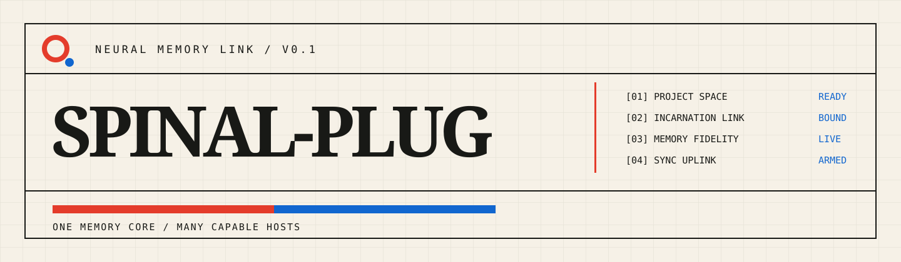

<p align="center">
  
</p>

<p align="center">
  <strong>让不同设备、不同 Agent，带着同一段项目连续性继续工作。</strong><br />
  <sub>不是复制意识。不是塞满历史对话。是让值得保留的经历安全回归，并在下一次启动时被重新装载。</sub>
</p>

<p align="center">
  <a href="#启动序列">启动序列</a> · <a href="#记忆的边界">记忆边界</a> · <a href="#接入宿主">宿主接入</a> · <a href="#快速接入">快速接入</a> · <a href="README.en.md">English</a>
</p>

---

## 一个 Agent 不该从空白开始

你在 Codex 做出迁移决策，在 Claude Code 接着排障，又在另一台设备继续开发。

**Spinal Plug** 把真正有长期价值的项目经验变成可追溯、可选择同步、可注入宿主原生记忆的信号。新的会话不必再从“这个项目是做什么的”开始。

```text
   做出判断                 选择发布                    继续工作

  Claude / Codex  ──►  SPINAL-PLUG  ──►  Claude / Codex
  独立会话与环境       受管的记忆链路        有界原生记忆投影
```

> **核心原则**：共享的是经过治理的项目经验，不是模型权重、隐藏状态、完整对话或无限上下文。

## 灵感：载入不是后台动作

Spinal Plug 的设计叙事受到《新世纪福音战士》中“进入系统前必须完成一段可见仪式”的张力启发：**连接、校准、确认、再行动**。这里借用的是这种产品节奏和控制室氛围，不使用任何角色、机体、标志、台词或原始画面。

所有图像均为 Spinal Plug 的原创资产；本项目与《新世纪福音战士》及其权利方不存在隶属、授权或认可关系。

<p align="center">
  
</p>

## 启动序列

```text
M E M O R Y   C O R E   B O O T   S E Q U E N C E

[01/05]  PROJECT SPACE        LINKED      当前目录已识别为同一个项目空间
[02/05]  INCARNATION LINK     BOUND       当前 Agent 会话已挂载项目身份
[03/05]  MIND CAPSULE         READY       有界启动上下文准备完成
[04/05]  MEMORY FIDELITY      LIVE        可用持久记忆已进入当前投影
[05/05]  SYNC UPLINK          ARMED       可发现其他分身发布的更新
```

| 术语 | 它真正表示什么 |
| --- | --- |
| **Spinal Plug** | 连接兼容 Agent 宿主的项目记忆链路。 |
| **Memory Fidelity** | 当前会话真正可用的持久记忆引用，不是虚构百分比。 |
| **Mind Capsule** | 有 token 预算的启动包，未来可扩展为角色与工作状态。 |
| **Incarnation Link** | 当前宿主会话与 Project Space 的绑定。 |
| **Sync Uplink** | 到兼容同步端点的受控连接。 |

## 记忆的边界

### 应该回归

```text
+ 技术/产品决策，以及为什么这样决定
+ 持续有效的项目规则和工作方式纠正
+ 无法直接从仓库推导出的关键项目背景
+ 权威外部资料、仪表盘、工单或规范的指针
```

### 不应回归

```text
- 密钥、Token、私有凭证
- 整段对话、工具原始输出、思维链
- “正在跑测试”一类短暂状态
- 必须重新从代码、Git 或外部系统核实的事实
```

当前工作的接力不应污染长期记忆。它应作为 **checkpoint / handoff** 独立保存：已完成什么、还缺什么、下一步是什么、有哪些阻塞。

## 不是强制同步，是可控装载

```text
FETCH                 PREVIEW                 APPLY                 PROJECT
发现远端更新     ──►  先看将发生什么     ──►  选择带入当前会话  ──►  写入宿主原生投影
```

你可以知道另一个分身学到了什么，而不必立刻让它改变当前工作上下文。删除和权限撤销属于安全例外，会优先执行。

<p align="center">
  
</p>

## 接入宿主

| 宿主 | 链路状态 | 具身方式 |
| --- | --- | --- |
| **Claude Code** | `ONLINE` | 生命周期 Hook + 受管 Auto Memory 投影。 |
| **Codex** | `ONLINE` | 生命周期 Hook + 有界候选提取 + 保留原生记忆投影。 |
| **Future Hosts** | `STANDBY` | 通过 Adapter Contract 与 MCP Surface 扩展。 |

Spinal Plug 不取代宿主记忆，也不覆盖用户自己写的内容。它只维护带受管标识的投影块。

<p align="center">
  
</p>

## 快速接入

### 01 / 构建客户端

```bash
pnpm install
pnpm build
pnpm typecheck
```

### 02 / 锁定当前项目

```bash
spinal-plug connect "$HOME/.spinal-plug/spinal-plug.db" .
spinal-plug boot "$HOME/.spinal-plug/spinal-plug.db" .
```

本地 SQLite 只是设备缓存与 Outbox。不会上传数据库文件；跨设备传输的是带来源、版本与删除语义的事件。

### 03 / 接入同步端点

不配置端点时，发布会先尝试本机开发中心（`127.0.0.1:8787`)，无人应答则静默留在本地模式——本地优先是默认，不需要认证，开箱即可测试。需要跨设备或跨 Agent 同步时才配置：

```bash
export SPINAL_PLUG_SYNC_URL="https://your-sync-endpoint.example"
export SPINAL_PLUG_DEVICE_ID="device-local"
```

公开客户端**不包含** Control Plane 服务。请接入或部署兼容同步端点。

### 04 / 在宿主中使用

Codex 与 Claude Code 的 marketplace manifests 位于 `plugins/`。安装后可使用：

```text
/spinal-plug:connect
/spinal-plug:share
/spinal-plug:sync
/spinal-plug:boot
```

## 项目状态

当前版本聚焦项目级持久记忆、宿主原生投影、本地优先存储和选择性同步。`Mind Core`、`Mind Capsule`、`Incarnation` 与更完整的工作交接已保留扩展方向，但不承诺不同模型会产生完全相同的行为。

## Documentation / 文档

- [Spinal Plug 术语与文案语气](docs/spinal-plug-voice.md)
- [Mind Runtime(Mind Core / Capsule / Incarnation)](docs/mind-runtime.md)
- [M1 本地工作流与 CLI 契约](docs/phase-m1-local-workflow.md)
- [M2 同步内核与边界](docs/phase-m2-sync-core.md)
- [Control Plane 控制台](docs/control-plane-console.md)
- [Claude Code 插件集成](docs/integrations/claude-code-plugin.md)
- [Codex 插件集成](docs/integrations/codex-plugin.md)
- [Claude Code 参考实现观察](docs/research/claude-code-reference-notes.md)

## 开发

```bash
pnpm test
pnpm typecheck
```

---

<p align="center">
  <strong>SPINAL-PLUG</strong><br />
  <sub>MEMORY FIDELITY · PROJECT CONTINUITY · MANY CAPABLE HOSTS</sub>
</p>
